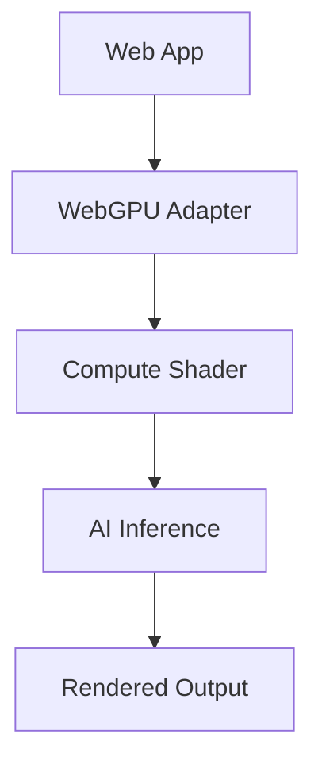

## Overview

Verridian AI Agency delivers high-performance applications by combining artificial intelligence with WebGPU acceleration. You gain insights into core principles that enable seamless AI integration, efficient rendering, and optimized performance. These concepts form the foundation for building innovative digital experiences.

<Columns cols={3}>
  <Card title="AI Integration" icon="brain" href="/docs/ai-integration">
    Embed machine learning models directly into web applications for real-time inference.
  </Card>
  <Card title="WebGPU Acceleration" icon="zap" href="/docs/webgpu">
    Harness GPU power in browsers for compute-intensive tasks like rendering and simulations.
  </Card>
  <Card title="Performance Optimization" icon="trending-up" href="/docs/optimization">
    Apply techniques to maximize throughput and minimize latency in AI-driven apps.
  </Card>
</Columns>

## AI Integration Basics

You integrate AI models into web apps using lightweight runtimes that handle inference without server dependencies. Verridian's solutions support TensorFlow.js and ONNX Runtime Web, allowing models trained in Python to run client-side.

<Steps>
  <Step title="Load Model" icon="download">
    Fetch your pre-trained model from a CDN or local storage.

````javascript
import * as tf from '@tensorflow/tfjs';

const model = await tf.loadLayersModel('https://cdn.verridian.ai/models/estimator.json');
````

  </Step>
  <Step title="Prepare Input" icon="edit-3">
    Preprocess user data into tensors compatible with the model.

````javascript
const inputTensor = tf.tensor2d([userFeatures], [1, featureCount]);
````

  </Step>
  <Step title="Run Inference" icon="play">
    Execute prediction and process outputs.

````javascript
const predictions = model.predict(inputTensor);
const results = await predictions.data();
````

  </Step>
</Steps>

<Callout kind="tip">
  Quantize models to 8-bit precision before deployment to reduce size by up to 75% while maintaining accuracy.
</Callout>

## WebGPU Rendering and Acceleration

WebGPU provides low-level GPU access in browsers, surpassing WebGL for compute shaders and parallel processing. You use it for AI model acceleration and real-time graphics rendering in Verridian apps.

<Tabs>
  <Tab title="WebGL (Legacy)" icon="eye">
    Limited to graphics pipelines; no general compute shaders.
  </Tab>
  <Tab title="WebGPU (Modern)" icon="zap">
    Full compute support for AI kernels and simulations.
  </Tab>
</Tabs>

Here's a basic WebGPU compute shader example for matrix multiplication, common in neural network layers:

<CodeGroup tabs="JavaScript,WGSL">
````javascript
async function initWebGPU() {
  const adapter = await navigator.gpu.requestAdapter();
  const device = await adapter.requestDevice();
  // Pipeline setup for compute shader
}
````
````wgsl
@group(0) @binding(0) var<storage, read> inputA: array<f32>;
@group(0) @binding(1) var<storage, read> inputB: array<f32>;
@group(0) @binding(2) var<storage, write> output: array<f32>;

@compute @workgroup_size(8, 8)
fn main(@builtin(global_invocation_id) id: vec3<u32>) {
  // Matrix multiply kernel
  output[id.x] = inputA[id.x] * inputB[id.y];
}
````
</CodeGroup>



## Performance Optimization Principles

You optimize Verridian apps by profiling GPU utilization, minimizing data transfers, and leveraging async compute. Focus on batching operations and using shared memory.

<ExpandableGroup>
  <Expandable title="Batching for Throughput" default-open="true">
    Process multiple inputs in one shader dispatch to amortize overhead.

    | Strategy | Benefit | Example Use Case |
    |----------|---------|------------------|
    | Batch Size 32 | 3x speedup | Image classification |
    | Dynamic Batching | Adaptive load | Real-time video |
    | Padded Batches | Fixed alignment | Neural rendering |
  </Expandable>
  <Expandable title="Memory Management">
    Use storage buffers over uniforms for large datasets. Avoid frequent CPU-GPU copies by staging data once.
  </Expandable>
</ExpandableGroup>

<Callout kind="info">
  Monitor with browser dev tools: Chrome's GPU profiler reveals bottlenecks in shader execution.
</Callout>

These concepts empower you to build scalable, responsive applications with Verridian's technology stack.