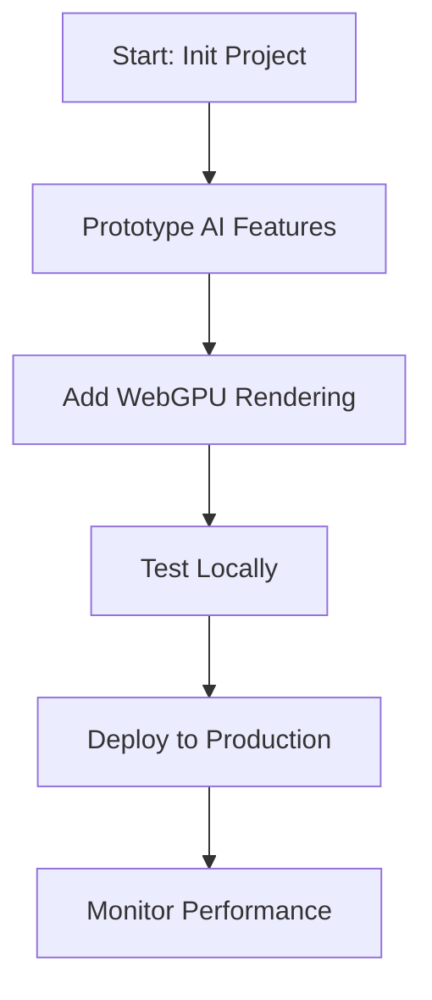

## Overview

Build high-performance applications with Verridian's AI and WebGPU tools. You start by setting up your project, integrate AI models for intelligent features, and leverage WebGPU for accelerated graphics. This guide walks you through the complete workflow, ensuring seamless prototyping to production deployment.

<Columns cols={3}>
  <Card title="Project Workflow" icon="git-branch" href="#project-workflow">
    Follow structured steps from idea to launch.
  </Card>
  <Card title="AI Model Deployment" icon="brain" href="#ai-model-deployment">
    Deploy models efficiently with minimal latency.
  </Card>
  <Card title="WebGPU Experiences" icon="globe" href="#webgpu-experiences">
    Create immersive, hardware-accelerated visuals.
  </Card>
</Columns>

## Project Workflow

Establish a reliable workflow to streamline development. Use these steps to prototype, test, and deploy your Verridian applications.

<Steps>
  <Step title="Initialize Project" icon="package">
    Create a new project directory and install dependencies.

    <CodeGroup tabs="npm,yarn">
      ```bash
      npm init -y
      npm install verridian-core verridian-ai verridian-webgpu
      ```
      ```bash
      yarn init -y
      yarn add verridian-core verridian-ai verridian-webgpu
      ```
    </CodeGroup>
  </Step>
  <Step title="Prototype Features" icon="edit-3">
    Build core functionality using Verridian SDK.

    ```javascript
    import { Verridian } from 'verridian-core';

    const app = new Verridian({
      apiKey: 'your-api-key',
      gpuEnabled: true
    });
    app.init();
    ```
  </Step>
  <Step title="Test and Deploy" icon="upload-cloud">
    Run tests and deploy to production.

    <Callout kind="tip">
      Use `verridian deploy` CLI for one-click deployment to edge networks.
    </Callout>
  </Step>
</Steps>



## AI Model Deployment

Deploy AI models directly in your browser or server with Verridian's optimized runtime. Choose your deployment method based on your needs.

<Tabs>
  <Tab title="Browser Deployment" icon="globe">
    Embed models client-side for instant inference.

    <CodeGroup tabs="JavaScript,TypeScript">
      ```javascript
      import { AIModel } from 'verridian-ai';

      const model = new AIModel('text-classifier-v1');
      const prediction = await model.predict('Analyze this text.');
      console.log(prediction);
      ```
      ```typescript
      import { AIModel } from 'verridian-ai';

      interface Prediction { score: number; label: string; }
      const model = new AIModel<'text-classifier-v1'>('text-classifier-v1');
      const prediction: Prediction = await model.predict('Analyze this text.');
      ```
    </CodeGroup>
  </Tab>
  <Tab title="Server Deployment" icon="server">
    Scale models on dedicated endpoints.

    ```bash
    verridian-ai deploy --model text-classifier-v1 --endpoint /api/predict
    ```
  </Tab>
</Tabs>

<Callout kind="success">
  Deployed models achieve `<50ms` latency on modern hardware.
</Callout>

## WebGPU Experiences

Harness WebGPU for real-time graphics and compute. Verridian abstracts complexity, letting you focus on creativity.

<Expandable title="Basic WebGPU Setup" default-open="true">
  Initialize a canvas and render loop.

  ```javascript highlight="3-5,8" show-lines={true}
  import { WebGPUCanvas } from 'verridian-webgpu';

  const canvas = document.getElementById('gpu-canvas');
  const gpu = new WebGPUCanvas(canvas);

  gpu.setupShader(`
    @vertex fn vs_main(@builtin(vertex_index) in_vertex_index: u32) -> @builtin(position) vec4<f32> {
      // Simple triangle shader
      let x = f32(i32(in_vertex_index) - 1);
      let y = f32(i32(in_vertex_index & 1u) * 2 - 1);
      return vec4<f32>(x, y, 0.0, 1.0);
    }
  `);

  function render() {
    gpu.draw();
    requestAnimationFrame(render);
  }
  render();
  ```
</Expandable>

<ExpandableGroup>
  <Expandable title="Advanced Compute Shaders">
    Accelerate AI post-processing with compute shaders.

    Integrate WebGPU compute for tasks like image upscaling or neural style transfer. Load your shader modules dynamically and dispatch compute pipelines.
  </Expandable>
  <Expandable title="Performance Tips">
    Enable GPU features conditionally:

    ```javascript
    if (navigator.gpu) {
      // WebGPU path
    } else {
      // Fallback to WebGL
    }
    ```
  </Expandable>
</ExpandableGroup>

Follow these practices to deliver performant, innovative applications powered by Verridian. Prototype quickly, deploy confidently, and scale effortlessly.