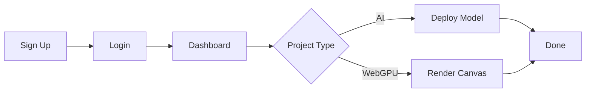

## Account Setup

Begin by creating your Verridian account to access premium AI solutions and WebGPU-accelerated experiences. Follow these steps to get started in under five minutes.

<Steps>
  <Step title="Sign Up" icon="user-plus">
    Visit [verridian.ai](https://verridian.ai) and click **Sign Up**.

    Enter your email, create a strong password, and verify your account via the confirmation email.

    <Callout kind="tip">
      Use a business email for team collaboration features.
    </Callout>
  </Step>

  <Step title="Log In" icon="log-in">
    Return to the login page and enter your credentials.

    Enable two-factor authentication (2FA) in your account settings for enhanced security.
  </Step>

  <Step title="Complete Profile" icon="settings">
    Update your profile with your name, organization, and preferred workspace.

    Select interests like **AI Models** or **WebGPU Rendering** to personalize your dashboard.
  </Step>
</Steps>

## Dashboard Tour

Once logged in, explore the Verridian dashboard. It provides quick access to projects, resources, and analytics.

<Columns cols={3}>
  <Card title="Projects" icon="folder" href="/docs/projects">
    Manage your AI models and WebGPU apps from one place.

    Create, edit, and deploy with a single click.
  </Card>

  <Card title="API Console" icon="terminal" href="/docs/api">
    Test endpoints instantly with real-time previews.

    Monitor usage and performance metrics.
  </Card>

  <Card title="Resources" icon="book-open" href="/docs/resources">
    Access documentation, templates, and community examples.

    Start with pre-built WebGPU shaders or AI pipelines.
  </Card>
</Columns>

## Create Your First Project

Launch a project tailored to AI or WebGPU. Choose based on your needs.

<Tabs>
  <Tab title="AI Model" icon="brain">
    Build a generative AI workflow.

    <Steps>
      <Step title="New Project" icon="plus">
        Click **New Project** > **AI Pipeline**.
      </Step>

      <Step title="Configure Model" icon="settings">
        Select a base model like GPT-4o or Llama 3.

        Set parameters: temperature `0.7`, max tokens `1024`.
      </Step>

      <Step title="Test & Deploy" icon="rocket">
        Run a sample prompt and deploy to a public endpoint.
      </Step>
    </Steps>

    <CodeGroup tabs="JavaScript,Python">
      ```javascript
      const response = await fetch('https://api.verridian.ai/v1/chat/completions', {
        method: 'POST',
        headers: {
          'Authorization': `Bearer ${YOUR_API_KEY}`,
          'Content-Type': 'application/json'
        },
        body: JSON.stringify({
          model: 'gpt-4o-mini',
          messages: [{ role: 'user', content: 'Generate a WebGPU shader example' }]
        })
      });
      const data = await response.json();
      console.log(data.choices[0].message.content);
      ```

      ```python
      import requests

      headers = {
          'Authorization': f'Bearer {YOUR_API_KEY}',
          'Content-Type': 'application/json'
      }
      data = {
          'model': 'gpt-4o-mini',
          'messages': [{'role': 'user', 'content': 'Generate a WebGPU shader example'}]
      }
      response = requests.post('https://api.verridian.ai/v1/chat/completions', json=data, headers=headers)
      print(response.json()['choices'][0]['message']['content'])
      ```
    </CodeGroup>
  </Tab>

  <Tab title="WebGPU App" icon="zap">
    Accelerate graphics rendering.

    <Steps>
      <Step title="New Project" icon="plus">
        Click **New Project** > **WebGPU Canvas**.
      </Step>

      <Step title="Initialize GPU" icon="settings">
        Paste this starter code into the editor.
      </Step>

      <Step title="Render & Share" icon="share">
        Preview in-browser and generate a shareable link.
      </Step>
    </Steps>

    ```javascript
    async function initWebGPU() {
      if (!navigator.gpu) throw new Error('WebGPU not supported');
      
      const adapter = await navigator.gpu.requestAdapter();
      const device = await adapter.requestDevice();
      
      const canvas = document.getElementById('gpu-canvas');
      const context = canvas.getContext('webgpu');
      const format = navigator.gpu.getPreferredCanvasFormat();
      
      context.configure({ device, format });
      
      console.log('WebGPU device ready');
    }
    
    initWebGPU();
    ```
  </Tab>
</Tabs>

<Expandable title="Troubleshooting Common Issues" default-open="false">
  - **Login fails?** Check spam for verification email or reset password.
  - **API key missing?** Generate one in **Account > API Keys**.
  - **WebGPU errors?** Ensure your browser supports it (Chrome 113+).

  <Callout kind="alert">
    Contact support@verridian.ai for billing or quota issues.
  </Callout>
</Expandable>



You now have a live project. Explore advanced features like collaborative editing and performance analytics next.